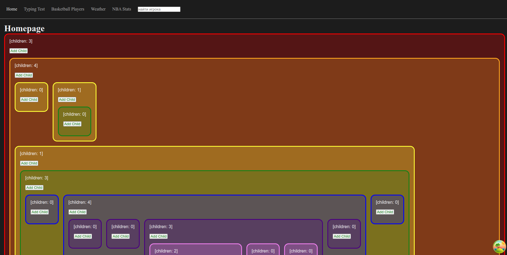
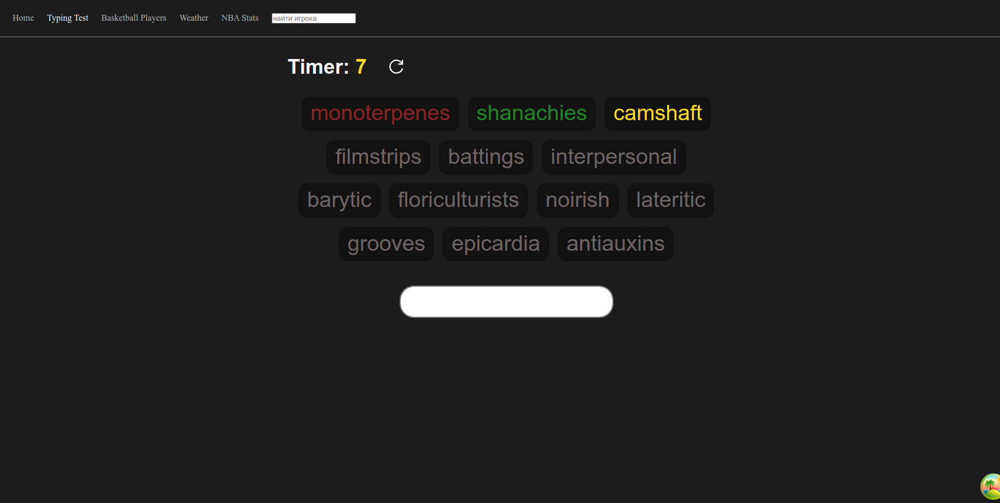
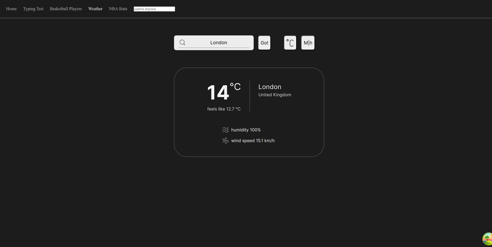
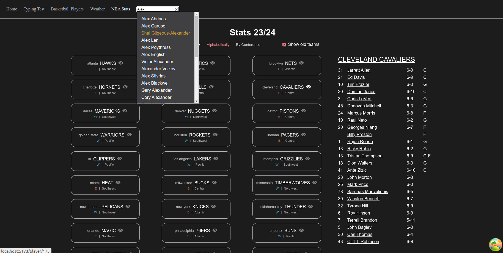
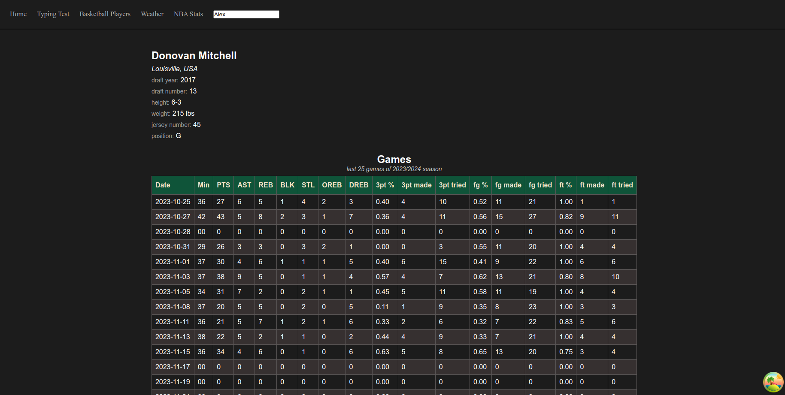

# React мини(-мини)-проекты

Набор небольших мини-проектов для практики React, его экосистемы и TypeScript.

**Ссылка: [URL](https://voluble-souffle-78badf.netlify.app/)** (деплой на Netlify)

## Стэк

- React
  - React Router
  - React-Query (Tanstack query)
- Vite
- TypeScript
- Styled Components (CSS-in-JS)
- SCSS, CSS модули

## Структура

0. Homepage, "рекурсивный" компонент.
1. Typing Test (по типу [MonkeyType](https://monkeytype.com/))
2. Basketball Players Cards (простейшая фильтрация, поиск, работа с Local Storage).
3. Weather (фетч данных с [WeatherAPI](https://www.weatherapi.com/))
4. NBA Stats (фетч данных с [BallDontLie](https://app.balldontlie.io/))

---

  
<strong>Cкриншоты</strong>

---
